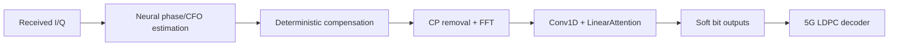

# Lightweight Physics-Informed Receiver for Pilot-Starved OFDM

A compact neural receiver for OFDM frames with one pilot symbol followed by eight data symbols. It combines learned phase/CFO estimation with explicit signal correction and lightweight attention to recover soft bits for LDPC decoding.

## Problem

OFDM receivers use pilot/reference symbols to estimate synchronization impairments. Reducing pilot density improves spectral efficiency, but gives the receiver fewer observations of phase and carrier frequency offset (CFO). In the **1-pilot / 8-data-symbol** regime, estimation error from the initial pilot causes residual phase drift across the subsequent data, making pilot-only synchronization unreliable in noise.

## Approach

The network learns physical impairments and residual corrections while known signal-processing operations stay explicit:



This physics-informed inductive bias reduces what the neural network must learn. Linear attention aggregates sequence context without constructing a full pairwise attention matrix.

## Model

- An MLP parameter estimator uses received pilot **and data** I/Q to regress phase and CFO.
- Differentiable de-rotation, CP removal, orthonormal FFT, and frequency-bin shifting produce frequency-domain features.
- Residual Conv1D blocks surround a lightweight `LinearAttention` block. FiLM-style scale/shift conditioning comes from the estimated physical parameters.
- Attention applies softmax to queries across features and keys across positions, then computes `Q(KᵀV)`. It is not an ELU+1 kernel implementation.
- An auxiliary I/Q reconstruction head supports training; a four-channel bit-logit head supplies soft information to the decoder.

CFO is in **cycles/sample**, and `phi0` is the phase at full-frame sample zero:

```text
phase(t) = phi0 + 2*pi*CFO*t
t_data = pilot_time_samples + local_data_index
```

Compensation applies the inverse rotation. The ×1000 CFO scaling is numerical scaling only. Training uses AdamW, cosine annealing, label smoothing, auxiliary I/Q and parameter losses, gradient clipping, and teacher forcing.

## Experimental setup

| Item | Setting |
| --- | --- |
| Waveform | OFDM; FFT 64, CP 16 samples |
| Modulation | 16-QAM data; QPSK pilot |
| Coding | 5G LDPC; 1024 information / 2048 coded bits; 15 decoder iterations |
| Frame | 1 pilot + 8 data OFDM symbols; 720 time samples |
| Impairments | Phase offset, CFO, AWGN |
| Phase / CFO range | [−π, π] radians / [−2e−4, 2e−4] cycles/sample |
| Historical Eb/N0 | 0–12 dB |
| Training | 10,000 examples; 80% at 4–8 dB, 20% at 0–12 dB; 85/15 train/validation split |

## Comparisons

- **Classical DSP:** pilot-only CFO grid search and phase estimation, deterministic correction, APP demapping, and LDPC decoding.
- **DeepRx (CNN):** a historical convolutional baseline for data-driven reception.
- **DAT (attention):** a historical attention baseline with higher reported compute cost.
- **Hybrid LA (ours):** physical compensation plus lightweight learned residual processing.

Only the hybrid and classical receiver are implemented in the current package. Baseline names identify the original project's implementations, not newly reproduced external results.

## Results

**Historical experimental results from the original project experiments.**

The corrected/refactored pipeline has **not been rerun**. These measurements used the original CFO correction, reused training subset seeds, and SNR-dependent neural LLR scaling. Current code corrects the CFO convention, separates random streams, and uses a fixed LLR scale (default 1.0). These are historical observations, not validated performance claims for current code.

Original-seed evaluation (2,000 frames per SNR; seed 46, also used in training):

| Method | Post-FEC BER @ 6 dB | Post-FEC BER @ 12 dB | BLER @ 12 dB |
| --- | --- | --- | --- |
| Classical DSP | 1.594e-01 | 8.593e-02 | 4.020e-01 |
| DeepRx (CNN) | 1.477e-01 | 1.004e-02 | 7.400e-02 |
| DAT (attention) | 3.037e-03 | 0.000e+00 | 0.000e+00 |
| Hybrid LA (ours) | 3.765e-02 | 5.513e-03 | 1.050e-02 |

Fresh-seed evaluation (1,024 frames per SNR; data seed 999, noise seed 888):

| Method | Post-FEC BER @ 6 dB | Post-FEC BER @ 12 dB |
| --- | --- | --- |
| Classical DSP | 1.631e-01 | 8.704e-02 |
| DeepRx (CNN) | 1.925e-01 | 3.396e-02 |
| DAT (attention) | 4.243e-03 | 0.000e+00 |
| Hybrid LA (ours) | 8.393e-02 | 3.025e-02 |

DAT recorded zero errors at some sampled SNRs; this does not establish zero error probability. Fresh-seed BLER was not printed and is left missing in the CSV.

Historical complexity:

| Method | Parameters | Approx. MFLOPs | ms/sample |
| --- | ---: | ---: | ---: |
| Hybrid LA (ours) | 276,888 | 72.57 | 0.08764 |
| DeepRx (CNN) | 297,924 | 343.72 | 0.12247 |
| DAT (attention) | 289,652 | 147.81 | 0.45562 |

FLOPs are approximate profiler outputs, not complete end-to-end operation counts. Latency measures neural forward passes at batch size 128, excluding LDPC and data generation; GPU models were not recorded in the selected outputs, so timings are not a controlled hardware comparison.

The hybrid targets a decoding-performance/compute trade-off: it recorded lower BER than DeepRx at the displayed points with lower reported compute, while DAT recorded better decoding performance at higher compute cost. See [benchmark data](results/benchmark_results.csv), [complexity data](results/complexity_results.csv), and the results notebook for source cells, protocols, and full curves.

## Repository structure

```text
README.md
requirements.txt
src/lightweight_receiver/
    __init__.py
    config.py
    simulation.py
    models.py
    training.py
    evaluation.py
    metrics.py
scripts/
    train.py
    evaluate.py
notebooks/
    01_problem_and_signal.ipynb
    02_results_and_comparison.ipynb
results/
    benchmark_results.csv
    complexity_results.csv
    figures/signal_12db.png
tests/
    test_pipeline.py
```

## Quick start

```bash
pip install -r requirements.txt
# Small pipeline exercise; not a benchmark run:
python scripts/train.py --num-examples 128 --epochs 1
python scripts/evaluate.py --checkpoint checkpoints/receiver.pt --num-examples 128 --ebn0-db 6 12
```

Evaluation defaults to experiment seed +10000 and a fresh noise seed; `--seed`, `--seed-noise`, and `--llr-scale` can override these. A one-epoch smoke checkpoint is not a trained benchmark model.

Start with [Problem and signal](notebooks/01_problem_and_signal.ipynb), then [Results and comparison](notebooks/02_results_and_comparison.ipynb). Both are short presentation notebooks viewable on GitHub or in a Jupyter-capable editor; neither trains a model.

## Notes

- Synthetic datasets are generated using Sionna.
- The experiment covers CFO, phase offset, and AWGN; it does not establish performance on multipath or over-the-air channels.
- This is a research prototype, not a production receiver.
- No dynamic SNR routing or classical-estimator injection is implemented or included in the comparison.
