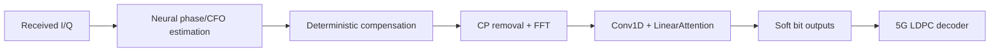

# Lightweight Physics-Informed Receiver for Pilot-Starved OFDM

A compact neural receiver for OFDM frames with one pilot symbol followed by eight data symbols. It combines learned phase/CFO estimation with explicit signal correction and lightweight attention to recover soft bits for LDPC decoding.

The synthetic communication link is built with **NVIDIA Sionna** components for modulation, OFDM processing, and 5G LDPC coding/decoding, while phase offset, carrier-frequency offset, and seeded AWGN are applied explicitly in the simulator.

## Problem

OFDM receivers use pilot/reference symbols to estimate synchronization impairments. Reducing pilot density improves spectral efficiency, but gives the receiver fewer observations of phase and carrier frequency offset (CFO). In the **1-pilot / 8-data-symbol** regime, estimation error from the initial pilot causes residual phase drift across the subsequent data, making pilot-only synchronization unreliable in noise.

## Approach

The network learns physical impairments and residual corrections while known signal-processing operations stay explicit:



This physics-informed inductive bias reduces what the neural network must learn. Linear attention aggregates sequence context without constructing a full pairwise attention matrix.

## Model

- An MLP parameter estimator uses received pilot **and data** I/Q to regress phase and CFO.
- Differentiable de-rotation, CP removal, orthonormal FFT, and frequency-bin shifting produce frequency-domain features.
- Residual Conv1D blocks surround a lightweight `LinearAttention` block. FiLM-style scale/shift conditioning comes from the estimated physical parameters.
- Attention applies softmax to queries across features and keys across positions, then computes `Q(KᵀV)`.
- An auxiliary I/Q reconstruction head supports training; a four-channel bit-logit head supplies soft information to the decoder.

CFO is in **cycles/sample**, and `phi0` is the phase at full-frame sample zero:

```text
phase(t) = phi0 + 2*pi*CFO*t
t_data = pilot_time_samples + local_data_index
```

Compensation applies the inverse rotation. The ×1000 CFO scaling is numerical scaling only.

## Experimental setup

| Item | Setting |
| --- | --- |
| Simulation backend | NVIDIA Sionna + explicit phase/CFO/AWGN impairments |
| Waveform | OFDM; FFT 64, CP 16 samples |
| Modulation | 16-QAM data; QPSK pilot |
| Coding | 5G LDPC; 1024 information / 2048 coded bits; 15 decoder iterations |
| Frame | 1 pilot + 8 data OFDM symbols; 720 time samples |
| Impairments | Phase offset, CFO, AWGN |
| Phase / CFO range | [−π, π] radians / [−2e−4, 2e−4] cycles/sample |
| Historical Eb/N0 | 0–12 dB |

## Comparisons

- **Classical DSP:** pilot-only CFO grid search and phase estimation, deterministic correction, APP demapping, and LDPC decoding.
- **DeepRx (CNN):** a historical convolutional baseline for data-driven reception.
- **DAT (attention):** a historical attention baseline with higher reported compute cost.
- **Hybrid LA (ours):** physical compensation plus lightweight learned residual processing.

Only the hybrid and classical receiver are implemented in the current package. Baseline names identify the original project's implementations, not newly reproduced external results.

## Results

Results below are archived from the original experiments for comparison. The refactored pipeline corrected synchronization and evaluation details but has not been rerun; these are historical measurements, not reproduced benchmarks.

**Historical fresh-seed comparison:** 1,024 frames per SNR, data seed 999, noise seed 888.

| Method | Post-FEC BER @ 6 dB | Post-FEC BER @ 12 dB | Approx. MFLOPs |
| --- | ---: | ---: | ---: |
| Classical DSP | 1.631e-01 | 8.704e-02 | — |
| DeepRx (CNN) | 1.925e-01 | 3.396e-02 | 343.72 |
| DAT (attention) | 4.243e-03 | 0 observed* | 147.81 |
| Hybrid LA (ours) | 8.393e-02 | 3.025e-02 | 72.57 |

**Key takeaway:** Hybrid LA historically achieved lower BER than the CNN baseline at both displayed fresh-seed operating points, using about **4.7× fewer reported FLOPs** than DeepRx. DAT recorded the strongest decoding results, with higher reported compute and neural-forward latency than Hybrid LA. The hybrid targets a **performance/efficiency trade-off**, rather than the lowest BER.

\* “0 observed” means no errors were observed in the finite evaluation sample, not zero error probability. “—” means unreported.

FLOPs are approximate profiler counts. Latency covers neural forward passes only; hardware was not recorded, so timings are not a controlled hardware comparison. [Results and provenance](notebooks/02_results_and_comparison.ipynb) include protocol details and the original-seed comparison; all values come from the [benchmark](results/benchmark_results.csv) and [complexity](results/complexity_results.csv) CSVs.

## Repository structure

```text
README.md
requirements.txt
src/lightweight_receiver/
    __init__.py
    config.py
    simulation.py
    models.py
    training.py
    evaluation.py
    metrics.py
scripts/
    train.py
    evaluate.py
notebooks/
    01_problem_and_signal.ipynb
    02_results_and_comparison.ipynb
results/
    benchmark_results.csv
    complexity_results.csv
    figures/signal_12db.png
tests/
    test_pipeline.py
```

## Explore the project

- [Problem & signal](notebooks/01_problem_and_signal.ipynb): the sparse-pilot problem and a representative OFDM frame.
- [Results & comparison](notebooks/02_results_and_comparison.ipynb): historical performance, compute, and limitations.
- [Core model](src/lightweight_receiver/models.py): physical compensation and lightweight attention.

Both notebooks are readable directly on GitHub; no execution is needed.

## Optional execution

```bash
pip install -r requirements.txt
# Small pipeline exercise, not a benchmark:
python scripts/train.py --num-examples 128 --epochs 1
python scripts/evaluate.py --checkpoint checkpoints/receiver.pt --num-examples 128 --ebn0-db 6 12
```

Evaluation uses fresh seeds and a fixed LLR scale by default. A one-epoch smoke checkpoint is not a trained benchmark model.

## Notes

- The synthetic link uses **NVIDIA Sionna** for the communications stack; phase offset, CFO, and AWGN are injected explicitly by the simulator.
- The experiment covers CFO, phase offset, and AWGN; it does not establish performance on multipath or over-the-air channels.
- This is a research prototype, not a production receiver.
- No dynamic SNR routing or classical-estimator injection is implemented or included in the comparison.
